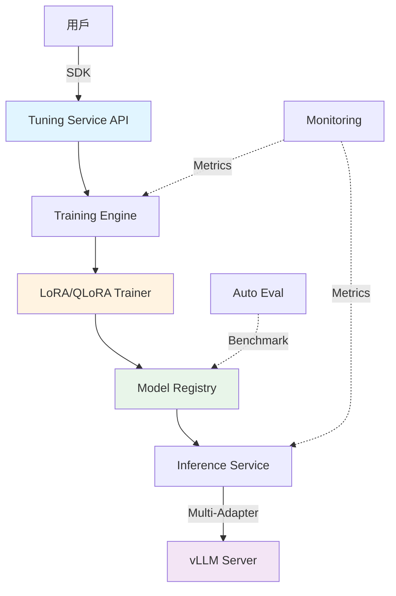

# 🧭 LLM Tuning Lab

> **企業級 LLM 微調與系統實作教學框架**
> 從 LoRA/QLoRA 實作到完整 AI Tuning Platform 的系統性學習專案

[](https://www.python.org/downloads/)
[](https://opensource.org/licenses/MIT)
[](https://github.com/psf/black)

## 📖 專案簡介

**LLM Tuning Lab** 是一個完整的 LLM 微調學習平台，專為想要深入理解並實作企業級 AI 系統的工程師設計。

### 🎯 學習目標

完成本專案後，你將能夠：

1. ✅ **手寫並解釋 LoRA/QLoRA** - 理解參數高效微調的核心原理
2. ✅ **自建訓練服務與 SDK** - 模擬雲端 AI 服務的 API 設計
3. ✅ **實作分散式訓練** - 使用 DeepSpeed/FSDP 進行多 GPU 訓練
4. ✅ **動態掛載多 Adapter** - 實現單一 Base Model 服務多任務
5. ✅ **監控、註冊、評測模型** - 建立完整的 MLOps 工作流
6. ✅ **維護版本化平台** - 管理模型生命週期

### 🏗️ 系統架構



---

## 📚 學習路徑

本專案包含 **8 個循序漸進的實作任務**，每個任務都可獨立完成：

| 任務 | 名稱 | 難度 | 預計時間 | 狀態 |
|------|------|------|----------|------|
| **01** | [LoRA 基礎實作](lab_tasks/task01_lora_basic/) | ⭐⭐ | 3-4 小時 | 🟢 可用 |
| **02** | [QLoRA 實戰與量化](lab_tasks/task02_qlora/) | ⭐⭐⭐ | 4-5 小時 | 🟢 可用 |
| **03** | [Tuning SDK 與 API](lab_tasks/task03_sdk_api/) | ⭐⭐⭐ | 5-6 小時 | 🟢 可用 |
| **04** | [分散式訓練](lab_tasks/task04_distributed_training/) | ⭐⭐⭐⭐ | 6-8 小時 | 🟢 可用 |
| **05** | [Adapter Serving](lab_tasks/task05_serving_adapter/) | ⭐⭐⭐ | 4-5 小時 | 🟢 可用 |
| **06** | [訓練監控](lab_tasks/task06_monitoring/) | ⭐⭐⭐ | 3-4 小時 | 🟢 可用 |
| **07** | [模型註冊表](lab_tasks/task07_artifacts_registry/) | ⭐⭐ | 3-4 小時 | 🟢 可用 |
| **08** | [自動化評測](lab_tasks/task08_autoeval/) | ⭐⭐⭐ | 4-5 小時 | 🟢 可用 |

### 📖 理論文檔

在開始實作前，建議先閱讀相關理論文檔：

- [📘 專案總覽](docs/00_overview.md) - 系統架構與設計理念
- [📙 LoRA 理論](docs/01_lora_theory.md) - Low-Rank Adaptation 原理
- [📕 QLoRA 與量化](docs/02_qlora_quantization.md) - 4-bit 量化技術
- [📗 SDK 設計](docs/03_sdk_design.md) - API 與客戶端設計模式
- [📔 訓練服務](docs/04_training_service.md) - 訓練任務管理
- [📓 監控與評測](docs/05_monitoring_eval.md) - 可觀測性設計
- [📒 模型註冊](docs/06_model_registry.md) - Artifact 管理
- [📑 推論服務](docs/07_serving_inference.md) - 高效推論架構

---

## 🚀 快速開始

### 環境需求

- **Python**: 3.10+
- **GPU**: NVIDIA GPU with CUDA 11.8+ (建議 24GB+ VRAM)
- **系統**: Linux (Ubuntu 20.04+) 或 WSL2
- **Docker**: 20.10+ (可選)

### 安裝步驟

#### 1. Clone 專案

```bash
git clone https://github.com/yourusername/llm-tuning-lab.git
cd llm-tuning-lab
```

#### 2. 建立虛擬環境

```bash
python -m venv venv
source venv/bin/activate  # Windows: venv\Scripts\activate
```

#### 3. 安裝依賴

```bash
pip install -r requirements.txt
```

#### 4. 驗證安裝

```bash
python scripts/check_environment.py
```

### 📝 開始第一個任務

```bash
cd lab_tasks/task01_lora_basic
cat README.md  # 閱讀任務說明
cat GUIDE.md   # 閱讀詳細指引
python train_lora_basic.py  # 開始訓練
```

---

## 📦 專案結構

```
llm-tuning-lab/
├── README.md                    # 本文件
├── docs/                        # 理論文檔
│   ├── 00_overview.md
│   ├── 01_lora_theory.md
│   └── ...
├── lab_tasks/                   # 練習任務
│   ├── task01_lora_basic/      # Task 01: LoRA 基礎
│   │   ├── README.md           # 任務說明
│   │   ├── GUIDE.md            # 詳細指引
│   │   ├── lora_linear.py      # 實作程式
│   │   ├── train_lora_basic.py # 訓練腳本
│   │   ├── checklist.md        # 驗收清單
│   │   ├── discussion.md       # 延伸問題
│   │   └── expected_output/    # 範例結果
│   ├── task02_qlora/           # Task 02: QLoRA
│   └── ...
├── src/                         # 核心程式碼庫
│   ├── lora_engine/            # LoRA 引擎
│   ├── tuning_service/         # 訓練服務
│   ├── sdk_client/             # SDK 客戶端
│   ├── trainer/                # 訓練器
│   ├── registry/               # 模型註冊
│   └── inference/              # 推論服務
├── examples/                    # 範例與配置
│   ├── config/                 # 配置檔案
│   ├── notebooks/              # Jupyter Notebooks
│   └── scripts/                # 輔助腳本
├── docker/                      # Docker 配置
│   ├── Dockerfile.trainer
│   ├── Dockerfile.service
│   ├── docker-compose.yml
│   └── k8s/                    # Kubernetes 配置
├── tests/                       # 測試程式
│   ├── unit/                   # 單元測試
│   └── integration/            # 整合測試
└── requirements.txt             # Python 依賴
```

---

## 🛠️ 技術棧

| 類別 | 技術 | 用途 |
|------|------|------|
| **深度學習** | PyTorch, Transformers | 模型訓練與推論 |
| **微調** | PEFT, bitsandbytes | LoRA/QLoRA 實作 |
| **分散式** | DeepSpeed, FSDP | 多 GPU 訓練 |
| **API** | FastAPI, Requests | 服務與 SDK |
| **推論** | vLLM, TGI | 高效推論引擎 |
| **監控** | Prometheus, Grafana | Metrics 收集與可視化 |
| **MLOps** | MLflow, DVC | 模型與數據版本管理 |
| **評測** | Rouge, BLEU, GPT-Eval | 模型評估 |
| **容器化** | Docker, Kubernetes | 部署與編排 |

---

## 📊 學習成果展示

完成各任務後，你將獲得：

### Task 01 - LoRA 基礎
- ✅ 手寫的 LoRA 模組實作
- ✅ 訓練 Loss 曲線圖
- ✅ Adapter 權重檔案

### Task 02 - QLoRA 實戰
- ✅ 4-bit 量化訓練實作
- ✅ FP16 vs QLoRA 性能比較
- ✅ 記憶體使用分析報告

### Task 03 - SDK 與 API
- ✅ 完整的訓練服務 API
- ✅ Python SDK 實作
- ✅ API 文檔與測試

### Task 04 - 分散式訓練
- ✅ DeepSpeed/FSDP 配置
- ✅ 多 GPU 訓練腳本
- ✅ Throughput 性能報告

### Task 05 - Adapter Serving
- ✅ 多 Adapter 推論服務
- ✅ 動態載入機制
- ✅ 推論效能測試

### Task 06 - 訓練監控
- ✅ Prometheus + Grafana 整合
- ✅ 自訂 Dashboard
- ✅ 實時監控系統

### Task 07 - 模型註冊
- ✅ MLflow 整合
- ✅ 模型版本管理系統
- ✅ Artifact 追蹤機制

### Task 08 - 自動評測
- ✅ 自動化評測框架
- ✅ 多種評測指標
- ✅ 評測報告生成

---

## 🧪 測試與驗證

### 運行單元測試

```bash
pytest tests/unit -v
```

### 運行整合測試

```bash
pytest tests/integration -v
```

### 檢查程式碼品質

```bash
# 格式化程式碼
black src/ lab_tasks/

# 排序 imports
isort src/ lab_tasks/

# Lint 檢查
flake8 src/ lab_tasks/

# 型別檢查
mypy src/
```

### 驗證整體進度

```bash
python scripts/evaluate_repo_progress.py
```

---

## 📖 學習建議

### 推薦學習路徑

1. **Week 1-2**: Task 01-02 (LoRA 基礎與 QLoRA)
2. **Week 3**: Task 03 (SDK 與 API 設計)
3. **Week 4**: Task 04 (分散式訓練)
4. **Week 5**: Task 05-06 (Serving 與監控)
5. **Week 6**: Task 07-08 (註冊與評測)

### 學習資源

- 📚 [Hugging Face PEFT 文檔](https://huggingface.co/docs/peft)
- 📚 [DeepSpeed 教學](https://www.deepspeed.ai/)
- 📚 [vLLM 文檔](https://docs.vllm.ai/)
- 📚 [MLflow 指南](https://mlflow.org/docs/latest/index.html)

### 常見問題

請查看 [FAQ.md](docs/FAQ.md) 或在 Issues 中提問。

---

## 🤝 貢獻指南

歡迎貢獻！請查看 [CONTRIBUTING.md](CONTRIBUTING.md) 了解詳情。

### 貢獻者行為準則

- 尊重所有貢獻者
- 提供建設性的回饋
- 遵循程式碼風格指南

---

## 📄 授權

本專案採用 MIT License - 詳見 [LICENSE](LICENSE) 文件。

---

## 🙏 致謝

本專案靈感來自企業級 LLM 訓練系統，感謝以下開源專案：

- [Hugging Face Transformers](https://github.com/huggingface/transformers)
- [PEFT](https://github.com/huggingface/peft)
- [DeepSpeed](https://github.com/microsoft/DeepSpeed)
- [vLLM](https://github.com/vllm-project/vllm)

---

## 📞 聯絡方式

- **Issues**: [GitHub Issues](https://github.com/yourusername/llm-tuning-lab/issues)
- **Discussions**: [GitHub Discussions](https://github.com/yourusername/llm-tuning-lab/discussions)

---

<div align="center">

**Happy Learning! 🚀**

Made with ❤️ for the AI Community

[開始學習](lab_tasks/task01_lora_basic/) | [閱讀文檔](docs/00_overview.md) | [查看範例](examples/)

</div>
