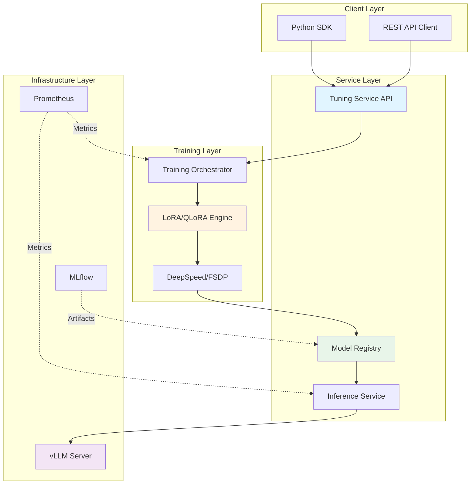
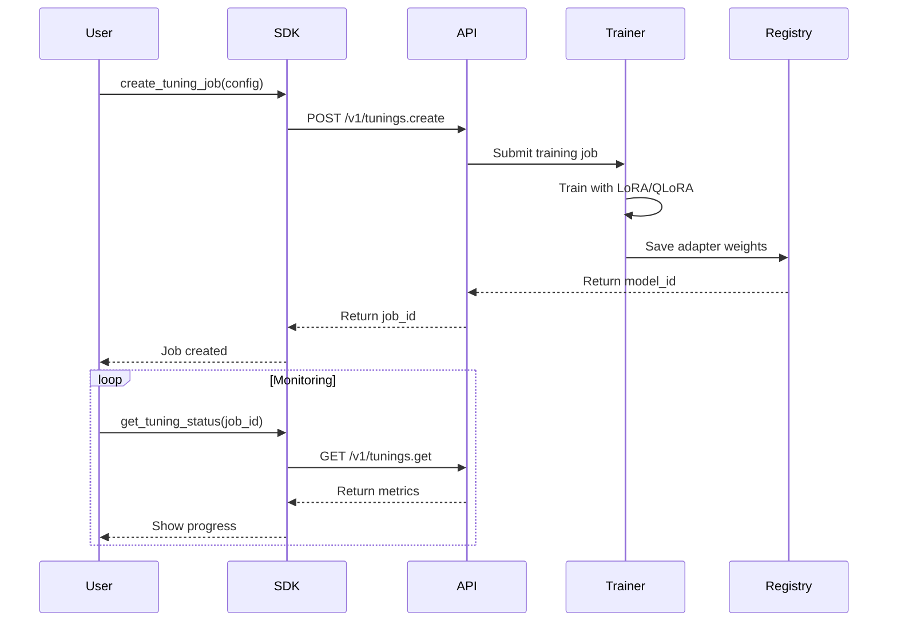
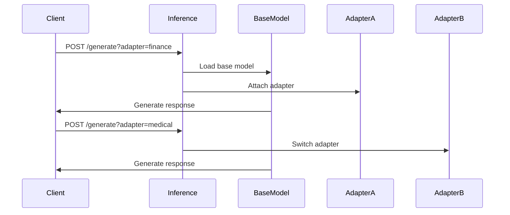

# 📘 專案總覽

> LLM Tuning Lab 系統架構與設計理念

## 🎯 專案定位

**LLM Tuning Lab** 是一個企業級 LLM 微調教學平台，模擬真實雲端 AI 服務的完整技術棧。

### 為什麼需要這個專案？

在 AI 工業化時代，理解 LLM 微調不僅需要知道「如何調用 API」，更需要深入「如何設計與實作 API」。

**本專案彌補的學習缺口：**

| 一般教學 | 本專案 |
|---------|--------|
| 調用 OpenAI API | 實作自己的 Tuning API |
| 使用 Hugging Face PEFT | 手寫 LoRA 模組 |
| 單機訓練 | 分散式訓練架構 |
| 載入模型 | 多 Adapter 動態掛載 |
| 查看 Loss | 完整監控與評測系統 |

---

## 🏗️ 系統架構

### 整體架構圖

### 核心模組說明

#### 1. **LoRA Engine** (核心引擎)
- 手寫 LoRA/QLoRA 實作
- 支援 4-bit/8-bit 量化
- 參數高效訓練

#### 2. **Tuning Service** (訓練服務)
- RESTful API 設計
- 訓練任務管理
- 狀態追蹤與回報

#### 3. **SDK Client** (客戶端)
- Python SDK
- 同步/非同步 API
- 錯誤處理與重試

#### 4. **Trainer** (訓練器)
- 分散式訓練支援
- DeepSpeed/FSDP 整合
- Checkpointing

#### 5. **Model Registry** (模型註冊)
- 版本化管理
- Artifact 追蹤
- MLflow 整合

#### 6. **Inference Service** (推論服務)
- 多 Adapter 熱掛載
- vLLM 高效推論
- 動態 Batch

---

## 🔄 完整工作流

### 訓練工作流

### 推論工作流

---

## 📊 技術棧選型

### 為什麼選擇這些技術？

| 技術 | 理由 | 替代方案 |
|------|------|----------|
| **PyTorch** | 工業標準，生態完善 | JAX, TensorFlow |
| **PEFT** | Hugging Face 官方支援 | 自行實作 |
| **DeepSpeed** | 微軟維護，成熟穩定 | FSDP, Megatron |
| **FastAPI** | 高效能，自動文檔 | Flask, Django |
| **vLLM** | 高吞吐量推論 | TGI, TensorRT-LLM |
| **MLflow** | 完整 MLOps 工具 | Weights & Biases |
| **Prometheus** | 雲原生監控標準 | Datadog, New Relic |

---

## 🎓 學習路線圖

### 階段一：基礎理論 (Week 1-2)

**目標：理解 LoRA 核心原理**

- 📖 閱讀：`01_lora_theory.md`
- 🔬 實作：Task 01 - 手寫 LoRA 模組
- 📊 實作：Task 02 - QLoRA 量化訓練

**產出：**
- ✅ 能解釋 LoRA 的低秩分解原理
- ✅ 能手寫 LoRA Layer
- ✅ 理解量化對記憶體與精度的影響

---

### 階段二：服務設計 (Week 3)

**目標：實作訓練服務與 SDK**

- 📖 閱讀：`03_sdk_design.md`, `04_training_service.md`
- 🔬 實作：Task 03 - 建立 API 與 SDK

**產出：**
- ✅ 設計 RESTful API
- ✅ 實作 Python SDK
- ✅ 理解 Async/Sync 模式

---

### 階段三：進階訓練 (Week 4)

**目標：掌握分散式訓練**

- 📖 閱讀：DeepSpeed/FSDP 文檔
- 🔬 實作：Task 04 - 多 GPU 訓練

**產出：**
- ✅ 配置 DeepSpeed ZeRO
- ✅ 實作 FSDP 訓練
- ✅ 效能優化與分析

---

### 階段四：生產部署 (Week 5-6)

**目標：建立完整 MLOps 流程**

- 📖 閱讀：`05_monitoring_eval.md`, `06_model_registry.md`, `07_serving_inference.md`
- 🔬 實作：Task 05-08

**產出：**
- ✅ 多 Adapter 推論服務
- ✅ Prometheus + Grafana 監控
- ✅ MLflow 模型管理
- ✅ 自動化評測框架

---

## 🎯 學習成果定義

完成本專案後，你應該能夠：

### 技術能力

1. **深度學習**
   - ✅ 理解 Transformer 架構
   - ✅ 掌握 LoRA/QLoRA 原理
   - ✅ 實作參數高效微調

2. **系統設計**
   - ✅ 設計 RESTful API
   - ✅ 實作 SDK 客戶端
   - ✅ 建立訓練服務

3. **分散式系統**
   - ✅ 配置 DeepSpeed/FSDP
   - ✅ 多 GPU 訓練優化
   - ✅ 記憶體與效能調優

4. **MLOps**
   - ✅ 模型版本管理
   - ✅ 監控與告警
   - ✅ 自動化評測

5. **部署運維**
   - ✅ Docker 容器化
   - ✅ Kubernetes 編排
   - ✅ 高效推論服務

### 職涯發展

**適合職位：**
- ML Platform Engineer
- AI Infra Engineer
- MLOps Engineer
- AI System Architect

**對標公司：**
- OpenAI (Tuning API)
- Anthropic (Fine-tuning)
- Cohere (Custom Models)
- Together AI (Training Platform)

---

## 📚 延伸閱讀

### 必讀論文

1. **LoRA**: [LoRA: Low-Rank Adaptation of Large Language Models](https://arxiv.org/abs/2106.09685)
2. **QLoRA**: [QLoRA: Efficient Finetuning of Quantized LLMs](https://arxiv.org/abs/2305.14314)
3. **DeepSpeed**: [ZeRO: Memory Optimizations Toward Training Trillion Parameter Models](https://arxiv.org/abs/1910.02054)

### 推薦資源

- 🌐 [Hugging Face PEFT Docs](https://huggingface.co/docs/peft)
- 🌐 [DeepSpeed Tutorial](https://www.deepspeed.ai/tutorials/)
- 🌐 [vLLM Documentation](https://docs.vllm.ai/)
- 🎥 [Andrej Karpathy - State of GPT](https://www.youtube.com/watch?v=bZQun8Y4L2A)

---

## 🤔 常見問題

### Q1: 我需要什麼基礎才能開始？

**A**: 建議具備：
- Python 程式設計 (中等以上)
- PyTorch 基礎 (了解 nn.Module)
- Transformer 概念 (至少知道 Attention)
- Linux 基本操作

### Q2: 需要什麼硬體設備？

**A**: 最低配置：
- GPU: NVIDIA RTX 3090 (24GB)
- CPU: 8 cores+
- RAM: 32GB+
- Storage: 100GB+

**建議配置：**
- GPU: A100 (40GB/80GB)
- 多 GPU 環境

### Q3: 完成整個專案需要多久？

**A**: 根據學習強度：
- 全職學習：3-4 週
- 業餘學習：6-8 週
- 深度研究：2-3 個月

### Q4: 可以用在實際專案嗎？

**A**: 可以！但需要額外考慮：
- 安全性與權限管理
- 資料隱私與合規
- 高可用性設計
- 成本優化

---

## 🚀 下一步

1. **閱讀理論文檔**：從 [01_lora_theory.md](01_lora_theory.md) 開始
2. **開始第一個任務**：[Task 01 - LoRA 基礎實作](../lab_tasks/task01_lora_basic/)
3. **加入社群討論**：在 GitHub Discussions 提問

---

**準備好了嗎？讓我們開始吧！🎓**

[下一篇：LoRA 理論](01_lora_theory.md) →

