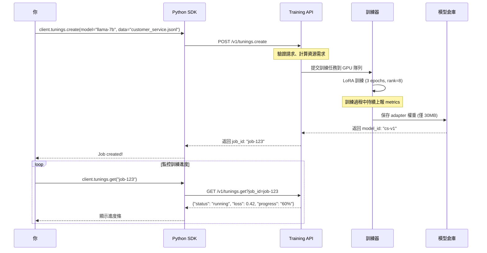
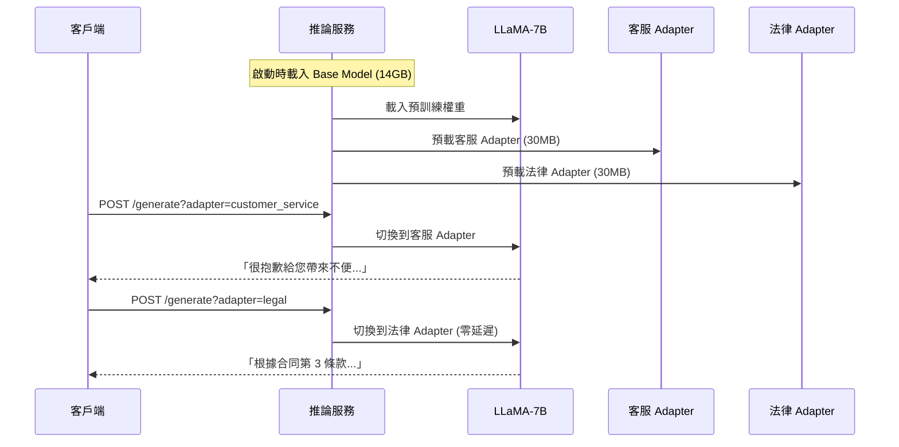

# 專案總覽

> LLM Tuning Lab 系統架構與設計理念

## 你可能遇到的問題

想像一下這個場景：

你是一位 ML 工程師，公司希望你為客服系統微調一個 LLaMA-7B 模型。你打開電腦，發現：

- **問題 1**: 
- **問題 2**: 
- **問題 3**: 
- **問題 4**: 
- **問題 5**: 

這些問題，就是這個實驗室要解決的。

這個專案的核心理念是：**不只是使用工具，而是理解並實作工具背後的系統**。


## 從訓練到部署：六個核心模組

讓我們跟著一個完整的 LLM 微調流程，看看每個模組解決什麼問題。

### 第一步：解決記憶體問題 - LoRA Engine

**場景**：你想微調 LLaMA-7B，但全參數微調需要 76GB，你只有 24GB 顯卡。

這時你需要 **LoRA Engine**：

**手寫 LoRA/QLoRA 實作**
不是調用 PEFT 庫就完事，而是從矩陣分解開始，理解為什麼 `W' = W + BA` 這個公式能用 1% 的參數達到全參數效果。當你手寫過一次，你才知道 rank 和 alpha 該怎麼調。

**支援 4-bit/8-bit 量化**
學會用 bitsandbytes 把模型壓縮到 4-bit，把 14GB 的記憶體需求降到 3.5GB。這樣一張 3090 也能訓練大模型。

**參數高效訓練**
實際體驗從 70 億參數降到 700 萬可訓練參數的感覺，理解「凍結 base model，只訓練 adapter」的威力。

---

### 第二步：提供服務界面 - Tuning Service

**場景**：同事想用你的訓練能力，但不想學 Python 腳本，他們想要「像 OpenAI 一樣簡單」。

這時你需要 **Tuning Service**：

**RESTful API 設計**
學習如何設計 `/v1/tunings.create`、`/v1/tunings.get` 這樣的 API，對標 OpenAI Fine-tuning API 和 GCP Vertex AI 的設計模式。

**訓練任務管理**
當有 10 個人同時提交訓練，你需要一個 Job Scheduler 來排隊、分配 GPU、處理優先級。這是企業級系統必備的能力。

**狀態追蹤與回報**
訓練是長時任務，你需要設計狀態機 (queued → running → succeeded/failed)，讓用戶隨時查詢進度，而不是傻等。

---

### 第三步：讓使用者更友善 - SDK Client

**場景**：API 設計好了，但直接用 curl 太麻煩，你需要一個好用的 Python SDK。

這時你需要 **SDK Client**：

**Python SDK**
學習如何封裝 HTTP 請求，設計像 `client.tunings.create()` 這樣直觀的接口，處理認證、錯誤訊息、重試邏輯。

**同步/非同步 API**
訓練可能跑幾小時，使用者要 `wait_for_completion()` 阻塞等待，還是 `create()` 後輪詢？兩種模式各適合什麼場景？

**錯誤處理與重試**
網路斷了怎麼辦？訓練失敗了要自動重試嗎？超時該設多久？這些細節決定系統好不好用。

---

### 第四步：突破單卡限制 - Trainer

**場景**：業務要求訓練 13B 模型，單卡裝不下，你需要多卡訓練。

這時你需要 **Trainer**：

**分散式訓練支援**
學習如何用 4 張卡訓練 13B 模型，理解 model parallelism 和 data parallelism 的差異。

**DeepSpeed/FSDP 整合**
掌握 ZeRO Stage 2/3 的配置，理解為什麼 FSDP 能把 optimizer states 切分到多張卡，讓記憶體需求線性降低。

**Checkpointing**
訓練跑了 10 小時突然斷電怎麼辦？學會設計 checkpoint 機制，每 1000 步保存一次，支援斷點續訓。

---

### 第五步：管理模型版本 - Model Registry

**場景**：你訓練了 20 個版本，3 個月後忘記哪個效果最好，當初的超參數也不記得了。

這時你需要 **Model Registry**：

**版本化管理**
每個訓練自動註冊一個版本號，記錄時間、配置、指標，隨時可以回滾到穩定版本。

**Artifact 追蹤**
不只是權重檔，還要記錄訓練日誌、評測結果、使用的數據集版本、環境依賴，確保可複現。

**MLflow 整合**
學習業界標準 MLOps 工具，理解 Experiment → Run → Model 的管理層級，建立完整的模型生命週期追蹤。

---

### 第六步：高效部署 - Inference Service

**場景**：訓練了客服、法律、醫療三個 adapter，總不能部署三個 7B 模型吧？

這時你需要 **Inference Service**：

**多 Adapter 熱掛載**
學習如何在一個 Base Model 上動態切換 adapter，客服請求來就掛客服 adapter，法律請求來就切法律 adapter，省下 2/3 的部署成本。

**vLLM 高效推論**
掌握 PagedAttention 和 Continuous Batching 技術，把推論吞吐量提升 10 倍以上。

**動態 Batch**
理解如何把零散的請求智能組批，在延遲和吞吐量之間找到最佳平衡點。

---

## 實際工作流程

### 場景一：訓練一個客服 Adapter

假設你是 ML 工程師，接到任務：「用公司的 1 萬條客服對話，微調一個專業客服模型」。

**你會經歷這些步驟：**



**關鍵設計點：**

1. **非同步設計**：訓練可能跑幾小時，API 立即返回 job_id，用戶輪詢查詢進度
2. **資源調度**：如果 GPU 滿載，任務進入隊列，用戶看到 `status: queued`
3. **輕量存儲**：adapter 只有 30MB，不需要存完整的 7B 模型

---

### 場景二：部署多任務推論服務

訓練完客服、法律、醫療三個 adapter 後，你需要部署推論服務。

**傳統做法**：部署 3 個 7B 模型，需要 42GB 顯存
**LoRA 做法**：1 個 base model + 3 個 adapter，只需 14GB + 90MB



**關鍵優勢：**

1. **零切換成本**：adapter 只是改變矩陣運算的一部分，不需要重新載入模型
2. **成本降低**：省下 28GB 顯存，可以部署更多任務或用更小的機器
3. **統一管理**：base model 更新時，所有 adapter 自動受益

---

### 當事情出錯時

**訓練失敗場景**：

```
訓練跑了 2 小時，突然 OOM (Out of Memory)
```

系統會怎麼處理？

1. **Trainer 檢測到錯誤**：立即保存當前 checkpoint
2. **更新任務狀態**：`status: failed`，記錄錯誤訊息
3. **用戶收到通知**：SDK 返回詳細錯誤和建議

```python
{
    "status": "failed",
    "error": "CUDA out of memory at step 1234",
    "suggestion": "嘗試降低 batch_size 或 rank"
}
```

**推論超載場景**：

```
突然湧入 100 個並發請求
```

vLLM 的動態 Batching 機制：

1. 把請求組成 batch，一次處理 32 個
2. 使用 PagedAttention 動態分配記憶體
3. 先進先出 (FIFO) 或優先級排序

---

## 技術選型：為什麼用這些工具？

技術選型不是拍腦袋決定的，而是根據實際需求做取捨。

### 訓練框架：為什麼是 PyTorch？

**你的需求**：需要靈活修改模型結構，手寫 LoRA 層，debug 時要看梯度流

**選擇考量**：
- **PyTorch**: 動態圖，debug 友善，Hugging Face 生態完整
- TensorFlow: 靜態圖優化好，但改模型結構麻煩
- JAX: 函數式編程，性能強，但學習曲線陡

**結論**：選 PyTorch，因為「能快速驗證想法」比「多 5% 性能」重要

---

### 微調方案：為什麼手寫 LoRA 而不是直接用 PEFT？

**你可能想**：PEFT 一行代碼就能用 LoRA，為什麼要自己寫？

**答案**：
- 用 PEFT 你學到：「調用函數」
- 手寫 LoRA 你學到：「為什麼 rank=8 比 rank=4 好」、「alpha 怎麼影響收斂」

這個專案的目標是「理解原理」，所以我們：
1. **Task 01**: 手寫 LoRA，理解矩陣分解
2. **Task 02**: 用 PEFT 的 bitsandbytes，但知道它在做什麼

---

### 分散式訓練：DeepSpeed vs FSDP

**場景**：你要訓練 13B 模型，4 張 A100 (40GB)

| 方案 | DeepSpeed ZeRO-3 | FSDP | 你該選哪個？ |
|------|-----------------|------|------------|
| **記憶體優化** | 激進切分，省記憶體 | 較保守，但穩定 | 顯存緊張選 DeepSpeed |
| **通訊效率** | 需要調優 | PyTorch 原生優化 | 多卡互聯好選 FSDP |
| **Debug 難度** | 較難 (分層多) | 較易 (原生整合) | 初學者選 FSDP |
| **生態支持** | Microsoft 主導 | Meta/PyTorch 官方 | 看團隊技術棧 |

**本專案做法**：兩個都教，Task 04 讓你實際比較

---

### API 框架：FastAPI vs Flask

**需求**：要提供 RESTful API，自動生成文檔，支持異步

| 特性 | FastAPI | Flask | Django |
|------|---------|-------|--------|
| **性能** | 高 (基於 Starlette) | 中 | 低 |
| **異步支持** | 原生 async/await | 需要擴展 | 不友善 |
| **自動文檔** | Swagger UI 自動生成 | 需要手寫 | 需要插件 |
| **類型檢查** | 基於 Pydantic | 無 | 無 |

**選擇 FastAPI 的原因**：
- 訓練任務是長時異步操作，FastAPI 的 `async def` 天然支持
- 自動生成的 `/docs` 讓團隊成員快速了解 API
- 類型檢查減少 bug（`model: str` vs `model: int`）

---

### 推論引擎：vLLM vs TGI vs TensorRT-LLM

**場景**：部署推論服務，要求高吞吐量、低延遲

| 引擎 | vLLM | Text Generation Inference (TGI) | TensorRT-LLM |
|------|------|--------------------------------|--------------|
| **PagedAttention** | 原創技術 | 無 | 無 |
| **LoRA 支持** | 原生多 Adapter | 單一模型 | 不友善 |
| **部署難度** | pip install 即用 | 需要 Docker | 需要編譯 |
| **性能** | 高 | 中 | 極高（但難用） |

**為什麼選 vLLM**：
1. **PagedAttention** 讓記憶體利用率提升 4 倍
2. 多 Adapter 切換是零成本的，符合我們的多任務需求
3. 開箱即用，不需要像 TensorRT-LLM 那樣編譯優化

**什麼時候選其他方案**：
- 如果你只部署一個模型，TGI 更穩定
- 如果你是 NVIDIA 生態且有 GPU 專家，TensorRT-LLM 性能最強

---

### 監控方案：Prometheus + Grafana vs Weights & Biases

**需求**：監控訓練進度、GPU 使用率、系統資源

| 方案 | Prometheus + Grafana | Weights & Biases | TensorBoard |
|------|---------------------|------------------|-------------|
| **部署位置** | 自建 | 雲端 SaaS | 本地 |
| **成本** | 免費 | 免費額度有限 | 免費 |
| **實時性** | 秒級更新 | 分鐘級 | 本地即時 |
| **團隊協作** | 需要自建 Dashboard | 雲端共享 | 不友善 |

**選擇 Prometheus + Grafana**：
- 企業環境通常不允許數據上傳到外部服務
- 完全可控，可以監控系統資源（CPU、GPU、網路）
- 與 Kubernetes 整合良好

---

### MLOps 工具：MLflow vs Weights & Biases

**需求**：模型版本管理、實驗追蹤、artifact 存儲

**MLflow 的優勢**：
- 開源免費，可以部署在內網
- 支持多種後端（S3、HDFS、本地）
- 輕量級，不需要複雜配置

**Weights & Biases 的優勢**：
- UI 更美觀，協作功能強
- 自動比較實驗結果

**本專案選 MLflow** 是為了教學「如何自建 MLOps 系統」，實際工作中可以根據公司預算選擇。

---

## 學習路線：從入門到實戰

### Week 1-2: 理解原理，手寫 LoRA

**本週目標**：不再只會調 API，而是真正理解「為什麼 LoRA 有效」

**學習任務**：
1. 閱讀 `01_lora_theory.md`，理解低秩分解的數學原理
2. Task 01：從零手寫 `LoRALayer`，實現 forward 和 backward
3. Task 02：實作 4-bit 量化，對比 FP16 vs QLoRA 的記憶體使用

**自我檢查點**：
- [ ] 能在白板上推導 `W' = W + BA` 的參數量計算
- [ ] 能解釋為什麼 rank=8 通常比 rank=4 好，但不是越大越好
- [ ] 能說出量化如何用 4-bit 表示 FP16 的值

**常見卡關點**：
- **卡在矩陣維度對不上**：畫圖！把 (batch, seq, hidden) 的每一步變換都畫出來
- **不理解 alpha/rank 的縮放**：先忽略它，訓練一次沒有縮放的版本對比
- **量化後精度下降太多**：檢查是否用了 NormalFloat4，而不是普通 int4

---

### Week 3: 從腳本到服務

**本週目標**：把訓練能力包裝成 API，讓別人也能用

**學習任務**：
1. 閱讀 `03_sdk_design.md` 和 `04_training_service.md`
2. Task 03：用 FastAPI 實作 `/v1/tunings.create` 和 `/v1/tunings.get`
3. 實作 Python SDK，封裝 HTTP 請求

**自我檢查點**：
- [ ] 能設計 RESTful API 的資源路徑和 HTTP 方法
- [ ] 理解為什麼訓練 API 要用異步模式而不是同步等待
- [ ] 能處理訓練失敗、超時、重試等邊界情況

**常見卡關點**：
- **API 設計不知從何下手**：先模仿 OpenAI 的 Fine-tuning API 設計
- **異步任務狀態管理混亂**：畫狀態機圖 (queued → running → succeeded/failed)
- **SDK 錯誤處理不知道怎麼寫**：參考 `requests` 庫的設計

**實戰提示**：
這週結束後，你應該能回答：「如果讓你設計 OpenAI 的 Fine-tuning API，你會怎麼做？」

---

### Week 4: 突破單卡限制

**本週目標**：用 4 張卡訓練 13B 模型，理解分散式訓練

**學習任務**：
1. 閱讀 DeepSpeed 和 FSDP 官方文檔
2. Task 04：分別用 DeepSpeed ZeRO-3 和 FSDP 訓練同一個模型
3. 對比兩者的記憶體使用、訓練速度、通訊開銷

**自我檢查點**：
- [ ] 能解釋 ZeRO Stage 1/2/3 分別切分什麼 (optimizer, gradient, parameter)
- [ ] 理解為什麼 FSDP 的通訊效率比 DDP 好
- [ ] 知道什麼時候用 DeepSpeed，什麼時候用 FSDP

**常見卡關點**：
- **多卡訓練速度反而變慢**：檢查是否有通訊瓶頸，網卡頻寬夠不夠
- **OOM 還是發生**：gradient checkpointing 開了嗎？batch size 是不是太大？
- **DeepSpeed 配置文件看不懂**：從最簡配置開始，逐步加優化

**Debug 技巧**：
- 用 `torch.distributed.barrier()` 確認各卡是否同步
- 用 `nvidia-smi dmon` 監控 GPU 通訊
- 訓練前先跑一個 epoch 確認配置沒問題

---

### Week 5-6: 生產級部署

**本週目標**：建立完整的 MLOps 流程，從訓練到部署一條龍

**學習任務**：
1. Task 05：部署 vLLM 推論服務，實現多 Adapter 切換
2. Task 06：用 Prometheus + Grafana 監控訓練和推論
3. Task 07：用 MLflow 管理模型版本和實驗
4. Task 08：實作自動化評測框架 (ROUGE, BLEU, GPT-Eval)

**自我檢查點**：
- [ ] 能在一個 Base Model 上熱切換 3 個不同的 adapter
- [ ] 能設計 Grafana Dashboard，監控 GPU 使用率、Loss、吞吐量
- [ ] 理解如何用 MLflow 追蹤實驗，回滾到穩定版本
- [ ] 能設計評測指標，判斷模型是否比上一版好

**常見卡關點**：
- **vLLM 多 Adapter 載入失敗**：檢查 adapter 路徑和 base model 是否匹配
- **Prometheus 抓不到 metrics**：確認 exporter 端口是否開放
- **MLflow 實驗記錄混亂**：規範命名格式，用 tags 分類

**實戰挑戰**：
- 能否在 30 分鐘內從零搭建一個可監控的訓練服務？
- 能否設計一套 A/B 測試流程，對比兩個模型的效果？

---

## 完成後你能做什麼？

### 技術面試時

**面試官**: 「你了解 LoRA 嗎？」
**你**: 「我不只用過，我手寫過完整的 LoRA Layer，可以解釋為什麼用 `W + BA` 能節省 99% 參數。」

**面試官**: 「如何設計一個訓練服務？」
**你**: 「我實作過對標 OpenAI 的 Fine-tuning API，包含異步任務管理、狀態追蹤、錯誤處理。」

**面試官**: 「遇到過 OOM 問題嗎？」
**你**: 「我用過 DeepSpeed ZeRO-3 和 FSDP，知道如何切分 optimizer states，並且實際對比過兩者的記憶體和速度。」

---

### 實際工作中

---

## 延伸閱讀

### 必讀論文（建議閱讀順序）

1. **LoRA 原始論文** - [LoRA: Low-Rank Adaptation of Large Language Models](https://arxiv.org/abs/2106.09685)
   - 讀這篇前先完成 Task 01，會更有感覺

2. **QLoRA 論文** - [QLoRA: Efficient Finetuning of Quantized LLMs](https://arxiv.org/abs/2305.14314)
   - 看懂 LoRA 後再看這篇，理解 4-bit 量化的威力

3. **DeepSpeed ZeRO** - [ZeRO: Memory Optimizations Toward Training Trillion Parameter Models](https://arxiv.org/abs/1910.02054)
   - Task 04 前必讀，理解記憶體切分策略

### 實用資源

- [Hugging Face PEFT 文檔](https://huggingface.co/docs/peft) - 看看工業界怎麼實作 LoRA
- [DeepSpeed 教學](https://www.deepspeed.ai/tutorials/) - 官方配置範例
- [vLLM 文檔](https://docs.vllm.ai/) - 學習 PagedAttention 原理
- [Andrej Karpathy - State of GPT](https://www.youtube.com/watch?v=bZQun8Y4L2A) - 了解 LLM 訓練全貌

---

## 常見疑問

### 「我只會 Python 基礎，能學嗎？」

**能**，但會辛苦一點。建議：
- 先補 PyTorch 官方教學的前 3 章
- 理解 `nn.Module`、`forward()`、`backward()` 就夠了
- 不需要精通，邊學邊查文檔也可以

**不建議**：完全沒寫過 Python 的人直接開始

---

### 「我沒有 GPU，能學嗎？」

**能學理論和設計部分**（Task 03, 06, 07），但訓練部分會很困難。

**替代方案**：
- 用 Google Colab 的免費 T4 (15GB)，可以跑 Task 01, 02
- 租用雲端 GPU（AWS, GCP, Lambda Labs）
- 用 CPU 跑，但訓練會非常慢

**最低需求**：至少要一張 12GB 以上的 NVIDIA 顯卡

---

### 「要花多少時間？」

**全職學習**（每天 6-8 小時）：
- Task 01-02: 3-4 天
- Task 03-04: 5-7 天
- Task 05-08: 7-10 天
- 總計：3-4 週

**業餘學習**（每週 10-15 小時）：
- 可以拉長到 6-10 週
- 建議每週完成一個 task

**深度研究模式**：
- 不只完成 task，還要改進和擴展
- 可能需要 2-3 個月

---

### 「學完能找到工作嗎？」

**直接找工作**：不太現實，這是一個教學專案，不是生產系統

**但是**：
- 面試時能展示你「理解原理」而非「只會調 API」
- 可以加到履歷的 Projects 部分
- 技術討論時能聊出深度

**建議搭配**：
- 實際微調一個有用的模型（例如客服、程式碼生成）
- 寫技術文章分享你的學習心得
- 參加 Kaggle 或開源專案

---

### 「可以直接用在公司專案嗎？」

**理論上可以，但要補充**：

生產環境還需要考慮：
- **安全性**：API 認證、權限管理、資料加密
- **穩定性**：錯誤恢復、健康檢查、自動重啟
- **可擴展性**：水平擴展、負載均衡
- **合規性**：資料隱私、模型可解釋性

這個專案專注於「核心技術」，生產級工程另外需要學習。

---

### 「卡關了怎麼辦？」

**Debug 流程**：
1. 看錯誤訊息，Google 關鍵字
2. 檢查配置檔和參數是否正確
3. 簡化問題（例如先用小模型、小數據測試）
4. 看每個 task 的 `discussion.md`，裡面有常見問題

**求助管道**：
- GitHub Issues: 貼上錯誤訊息和復現步驟
- 社群討論區
- Stack Overflow（標註 pytorch, lora, deepspeed）

**時間原則**：卡超過 2 小時就先看解答，理解後再自己重寫一遍

---

## 開始你的學習之旅

### 建議的第一步

**如果你想先了解全貌**：
- 花 30 分鐘瀏覽這份 overview
- 看看 [01_lora_theory.md](01_lora_theory.md) 的前半部分
- 理解「為什麼需要 LoRA」

**如果你想直接動手**：
- 跳到 [Task 01](../lab_tasks/task01_lora_basic/README.md)
- 按照 GUIDE.md 逐步實作
- 遇到不懂的再回來看理論

**如果你想評估是否適合**：
- 先看「常見疑問」部分
- 確認硬體和時間是否足夠
- 可以先跑 Task 01 試試手感

---

### 學習心態建議

**這個專案不是為了**：
- 快速完成拿證書（沒有證書）
- 複製貼上就能跑的代碼（需要思考和 debug）
- 讓你馬上成為專家（需要持續學習）

**這個專案是為了**：
- 理解 LLM 微調的底層原理
- 培養系統設計的思維方式
- 建立解決實際問題的能力

**預期的學習曲線**：
```
挫折感 ▲
        │    ╱╲
        │   ╱  ╲        ╱
        │  ╱    ╲      ╱
        │ ╱      ╲____╱    ← 突然開竅的時刻
        │╱
        └────────────────────► 時間
         開始  Week2  Week4
```

**什麼時候會有「開竅」的感覺**：
- Task 01 完成，看到 LoRA 真的比全參數少 99% 參數時
- Task 03 完成，理解「API 原來是這樣設計的」時
- Task 04 完成，第一次成功跑起 4 卡訓練時
- Task 05 完成，看到一個 Base Model 切換三個 Adapter 時

---

### 準備好了嗎？

選擇你的路徑：

1. **我要從理論開始** → [LoRA 理論](01_lora_theory.md)
2. **我要直接動手** → [Task 01: LoRA 基礎實作](../lab_tasks/task01_lora_basic/)
3. **我想看看整體架構** → 繼續讀其他文檔 (02-07)

---

> **最後提醒**
>
> 學習 LLM 微調不是一蹴而就的過程，卡關是正常的，放棄才是失敗。
>
> 每完成一個 task，你就比 90% 只會調 API 的人更懂原理。
>
> 祝你學習愉快！

---
